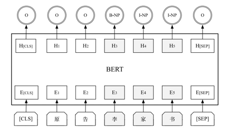
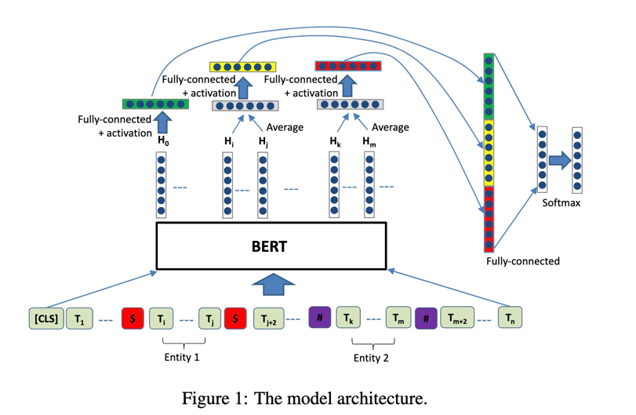

# 关系抽取
> 采用pipeline的方式实现关系抽取。

# 步骤
## 1. 实体抽取

- "张三是小明的父亲" -实体识别-> ["B-PER", "I-PER", "O", "B-PER", "I-PER", "O", "O", "O"]

## 2. 关系分类
- https://arxiv.org/abs/1905.08284

- 

- "张三是小明的父亲" --> "[unused1]张三[unused1]是[unused2]小明[unused2]的父亲"
- 在bert抽取完信息后，提取 [cls] + mean(ENTITY1) + mean(ENTITY2) 进行分类